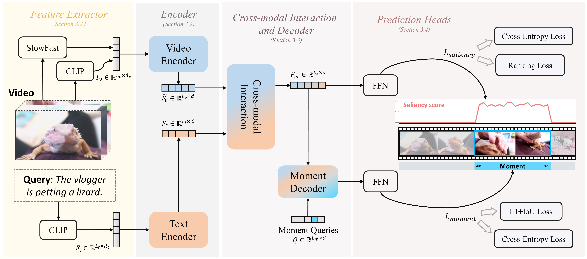

# MH-DETR: Video Moment and Highlight Detection with Cross-modal Transformer

This is our implementation for the paper: **MH-DETR: Video Moment and Highlight Detection with Cross-modal Transformer**



## Abstract

With the increasing demand for video understanding, video moment and highlight detection (MHD) has emerged as a critical research topic. MHD aims to localize all moments and predict clip-wise saliency scores simultaneously. Despite progress made by existing DETR-based methods, we observe that these methods coarsely fuse features from different modalities, which weakens the temporal intra-modal context and results in insufficient cross-modal interaction. To address this issue, we propose **MH-DETR** (**M**oment and **H**ighlight **DE**tection **TR**ansformer) tailored for MHD. Specifically, we introduce a simple yet efficient pooling operator within the uni-modal encoder to capture global intra-modal context. Moreover, to obtain temporally aligned cross-modal features, we design a plug-and-play cross-modal interaction module between the encoder and decoder, seamlessly integrating visual and textual features. Comprehensive experiments on QVHighlights, Charades-STA, Activity-Net, and TVSum datasets show that MH-DETR outperforms existing state-of-the-art methods, demonstrating its effectiveness and superiority. Our code is available at -.

## Table of Contents

1. [Setup](##Setup)
2. [Usage](##Usage)

## Setup

The released code consists of the following files.

```
MH-DETR
├── data
│   ├── activitynet
│   │   └── {train,val}.pkl
│   ├── charades
│   │   └── {train,val}.pkl
│   ├── tvsum
│   │   └── tvsum_{train,val}.jsonl
│   └── highlight_{train,val,test}_release.jsonl
├── features
│   ├── activitynet
│   │   └── c3d.hdf5
│   ├── charades
│   |   ├── vgg.hdf5
│   │   └── i3d.hdf5
|   ├──	clip_features
|   ├── clip_text_features
|   ├── slowfast_features
|   └── tvsum
├── mh_detr
├── standalone_eval
├── utils
├── results
├── README.md
└── ···
```

## Dependencies

```sh
# create conda env
conda create --name mh_detr python=3.9
# activate env
conda actiavte mh_detr
# install pytorch 1.13.1
conda install pytorch=1.13.1 torchvision torchaudio -c pytorch
# install other python packages
pip install tqdm ipython easydict tensorboard tabulate scikit-learn pandas timm fvcore
```

## Datasets

### QVHighlights

Download [QVHighlights annotations](https://github.com/jayleicn/moment_detr/tree/25c8a73ccc54390265d17ac2c26e98eb6267c035/data).

Download [QVHighlights_features.tar.gz](https://drive.google.com/file/d/1Hiln02F1NEpoW8-iPZurRyi-47-W2_B9/view?usp=sharing) (8GB) from [Moment-DETR](https://github.com/jayleicn/moment_detr/tree/25c8a73ccc54390265d17ac2c26e98eb6267c035) repo, extract it under project root directory:

```
tar -xf path/to/moment_detr_features.tar.gz
```

### Charades-STA

Download [VGG features]() for Charades-STA official server.

Download [I3D features (password: 1234)](https://pan.baidu.com/s/1RmkDsSidnShnqqRbA0TK8g?pwd=1234) for Charades-STA.

### ActivityNet

Download [C3D features]() for ActivityNet.

### TVSum

Download [TVSum features](https://connectpolyu-my.sharepoint.com/personal/21039533r_connect_polyu_hk/_layouts/15/onedrive.aspx?id=%2Fpersonal%2F21039533r%5Fconnect%5Fpolyu%5Fhk%2FDocuments%2FZoo%2FReleases%2FUMT%2Ftvsum%2Dec05ad4e%2Ezip&parent=%2Fpersonal%2F21039533r%5Fconnect%5Fpolyu%5Fhk%2FDocuments%2FZoo%2FReleases%2FUMT&ga=1) from [UMT](https://github.com/TencentARC/UMT) repo.

## Usage

### Train on QVHighlights

```sh
bash mh_detr/scripts/train.sh
```

### Evaluation on QVHighlights

```sh
bash mh_detr/scripts/inference.sh ${Your_Path}/MH-DETR/results/qvhighlights/model_best.ckpt val
```

Checkpoint download [link](https://drive.google.com/file/d/15Hq5zNoe51eX1M8vA_tEWWhaDlGsgoCe/view?usp=sharing). Please replace ${Your_Path} with your path. The result is as follows:

| MR R1@0.5 | MR R1@0.7 | MR mAP Avg. | HD ($\geq$ VG) mAP | HD ($\geq$ VG) HIT@1 | Params | GFLOPs |
| :-------: | :-------: | :---------: | :----------------: | :------------------: | :----: | :----: |
|   60.84   |   44.90   |    39.26    |       38.77        |        61.74         |  8.2M  |  0.34  |

### Test on QVHighlights

```sh
bash mh_detr/scripts/inference.sh ${Your_Path}/MH-DETR/results/qvhighlights/model_best.ckpt test
```

### Train on other datasets

```sh
bash mh_detr/scripts/train_charades.sh --dset_name ${Dataset_Name}
```

Please replace ${Dataset_Name} with {activitynet, charades, tvsum}.

### Debug

```sh
bash mh_detr/scripts/train.sh --debug
```

